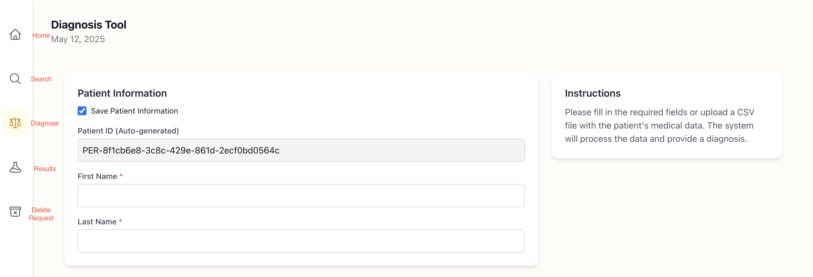

# csi-43c9-capstone-tuberculosis

## Website Link

The website is available and deployed to **https://csi-43c9-capstone-tuberculosis-steel.vercel.app/**

## How to use

1. **Create an Account (Signup):** If you are a new user, start by signing up by clicking the sign up button. If you wish to stay anonymous, you may continue as guest.
2. **Login:** Once you have made an account, you will be redirected to the login page where you can login with the email and password you created.
3. **Diagnose:** Using the sidebar, navigate to the diagnose page. This is indicated by the _balance_ icon. See the image below to see what each icon means. You can manually input data or upload a csv/excel file.
4. **View Results:** After submitting the data in the diagnose page, you will be redirected to the results page where you can view the results.
5. **Manage Your Scans:**
   - The **Home** page will show all of your recent scans. Here you can select one and view it. If you wish to delete the scan, you may do so by hovering over the scan and selected the *trash can* icon.
   - The **Search** page allows you to search for specific scans you have completed in the past.
6. **Manage Your Data:** If you wish to delete your account and all your data, you may do so on this page

## Detailed Features

### 1. Signup

- A user is able to sign up to our website. By navigating to the signup page, they will prompted to enter their:
  - Full Name
  - Email Address
    - This must be unique. A user cannot have multiple accounts with the same email address
  - Password
  - Confirm Password
  - I am a doctor
    - This checkbox is optional. If the user is not a registered professional, they should not check this box.

### 2. Login

- Once an account is created, a user will be redirected to the login page. There they will be prompted to enter their: 
    - Email Address 
    - Password
- Upon success, they will be redirected to the home page. If the combination of email and password is incorrect, they will be notified that their credentials are invalid.

### 3. Home

- The home page contains recent scans that have been done by the currently logged in user. These can be clicked on to produce a more detailed information display.
- Hovering over one of the Recent Scans will open a trash can icon which can be used to delete single scans.
- The home page is indicated in the sidebar by the house icon.

### 4. Search

- The search page is where a user is able to search for specific scans that they have done themselves. Results from other users will not show up.
- To search they will type a name or portion of a name, and all matching results will be returned 
    - Each returned result is clickable and will open up a more detailed view of the scan.
- The search page is indicated in the sidebar by the magnifying glass icon

### 5. Diagnose

- The diagnose page is where a user is able to upload a csv or excel file, or manually input data to be sent to our model. This model will return a prediction to what resistance type the user has based on their inputs.
- Once the data is submitted, it is validated and sent off to our models. The results will then be displayed in our results tab, which the user will automatically be redirected to.
- If the option to save the results is selected, the results will be stored in our database and will be visible to the user in the home page and search page.
- The diagnose page is indicated in the sidebar by the scale icon.

### 6. Results

- The results page is where the user will see their results after uploading data. It shows the overall resistance type, and then if available, the types of drugs the dataset the user uploaded it resistant to.
- The results page is indicated in the sidebar by the beaker icon.

### 7. Data Deletion Request

- A user is able to request the deletion of their data, which will be automatically
  processed.
- Upon being processed, it will delete every scan result associated with that user ID. After which, the user's account will be deleted and they will be redirected to the home page.
- The user will no longer be able to log in with their prior credentials and will have to create a new account.
- The data deletion request page is indicated in the sidebar by the archive box icon

### 8. Guest View

- The guest view is for users who do not wish to create an account but still want to
access the service.
- The guest view is unable to view the home and search pages. They also do not
have access to save their results

## Developer Docs
Both frontend and backend use yarn. To run, use the command `yarn dev` in both the frontend and backend directories.
- In order to use features such as login, signup, or save, it is necessary to locally have a mongoDB instance. In the `/backend` directory, create a `.env` file and assign your MongoDB URI to a variable there. It should resemble: `MONGO_URI=mongodb+srv://<your-mongo-uri>`
